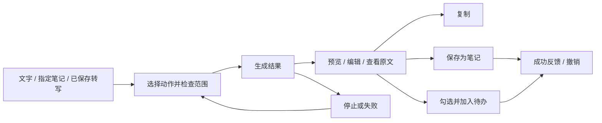

# AI 入口与交互设计

> 待开发规格；合并界面地图与视觉规范。基于现有 Electron 原生 HTML/CSS/JavaScript，沿用设置分类、模块布局和窗口行为。

## 1. 导航与入口

不新增顶栏 AI 页签。优先在用户已有材料旁提供动作，以启动器作为统一查找入口。

| 位置 | 入口 | 默认上下文 | 返回位置 |
| --- | --- | --- | --- |
| 启动器 | 摘要文字、精简文字、翻译文字、从文字提取待办 | 空输入；用户键入或主动粘贴 | 原查询、原选中结果 |
| 笔记工具栏 | “整理”菜单 | 编辑器当前选区；无选区时使用整篇正文 | 当前笔记与滚动位置 |
| 录音详情 | “整理录音” | 已保存的完整转写，超限则选范围 | 当前录音详情 |
| 待办页 | “从文字添加”次级动作 | 空输入，带当前四领域显示名 | 原时间视图和滚动位置 |
| 设置 → AI 与转写 | 内容整理、实时转写、自动动作 | 配置状态，不含正文 | 原设置分类 |

首版不新增全局快捷键。继续使用启动器已有快捷键，避免与应用新窗口/管理员动作、正则模式切换冲突。

启动器 AI 命令只负责打开工作台内的共用整理视图，进入既有 `expanded` 模式；不把长结果挤进原搜索结果列表。打开时记录来源、查询、焦点与滚动，返回时恢复。普通查询、正则查询和无结果状态不会自动发送网络请求。

## 2. 主要流程



### 流程 A：从文字提取待办

1. 用户在启动器找到“从文字提取待办”，Enter 打开整理视图。
2. 输入区获得焦点；用户粘贴或输入内容。底部显示“将发送给 [服务名称] · 选择的文字”。
3. 点击“生成待办草稿”；产生等待状态和停止按钮。
4. 结果逐项显示复选框、标题、领域、截止时间、原文摘录。模型返回完整并通过校验后，任务才可编辑/保存。
5. 有明确依据、合法日期的项可默认选中；日期或领域待确定的项显示“待补充”，不计入可保存数量。
6. 用户修改、取消勾选、补日期。底部显示“已选 2 项 · 1 项待补日期”。
7. 点击“加入 2 项待办”，成功后显示“已加入 2 项”及“查看待办 / 撤销”。生成过但未应用的其余项仍为草稿。

所有正式待办必须有 deadline。不存在“先偷偷塞进今天，回头用户再改”的路径。

### 流程 B：录音变成笔记与行动项

1. 录音结束后音频与转写先保存，麦克风立即释放。
2. 录音详情出现“整理录音”按钮；没有转写时显示“暂无转写，可编辑文字后整理”，不假称已能上传旧音频重新识别。
3. 点击后预览本次范围；超过上限则先选择文本范围。开始生成摘要、明确决定和行动项。
4. 摘要/行动项通过两个切换项查看，保持当前页滚动稳定。
5. “保存为笔记”仅保存整理后的文本，成功后按钮显示“已保存，打开笔记”。
6. “加入待办”独立完成日期与领域审阅。某个保存失败时，不撤销另一个已成功的操作，也不显示全部失败。

### 流程 C：笔记改写

- 选区摘要、精简、翻译或提取待办：保持源选区快照。
- 无选区时可摘要/精简/翻译整篇，但默认提供“复制 / 保存为新笔记”。
- “替换选区”仅对精简/翻译出现；选区不得跨越图片引用，原文及编辑器选区范围校验通过后应用。
- 点击替换前始终可查看原文与结果。应用后提供撤销；源正文被用户继续编辑后，撤销仅在目标字段仍匹配时执行，否则说明冲突并允许复制旧文。
- 标题生成在笔记的标题菜单独立出现，结果预览后再采纳；手工标题不会被后台请求覆盖。

## 3. 共用整理视图

### 3.1 布局

复用工作台可用内容区，上限 1240 × 540 DIP；头部和操作条是固定 flex 子元素，中间区域 `min-height: 0; overflow: auto`。不用原生窗口 resize 展示流式内容。

```text
┌ 返回笔记     摘要              [来源：产品讨论]     关闭 ┐
│ 输入 / 结果切换       服务名称 · 所选文字 2,340 字符      │
├───────────────────────────────────────────────────────┤
│ 正文、摘要或可编辑任务列表                              │
│                                                       │
│ 原文依据可展开；未确定字段就地修正                      │
│                                                       │
├───────────────────────────────────────────────────────┤
│ 尚未保存 / 失败说明      复制   保存笔记   加入 2 项待办 │
└───────────────────────────────────────────────────────┘
```

- 内容宽度 ≥ 900 DIP：文本动作可在同一滚动容器中并排展示原文和结果，比例约 40:60；待办模式优先给候选列表完整宽度。
- 小于 900 DIP：原文/结果切换，单列展示；底部操作换行，不产生横向整页滚动。
- 640 × 400 DIP 验收：底部按钮必须可见，输入/结果区可滚动；更小空间时操作条可随容器滚动，不能遮挡最后一项。
- 同一视图使用一个主滚动区；候选卡片本身不各自滚动，长原文通过展开/收起控制。
- 不把加载结果通过 `innerHTML` 重建整页；使用稳定候选 ID，更新状态时保留用户编辑、滚动与焦点。

### 3.2 视觉规范

沿用 `--surface-*`、`--text-*`、`--hairline*`、`--focus-ring` 等现有 token，在新增 `renderer/ai.css` 集中定义用途和尺寸。

- 页面标题约 16px，内容 13–14px，辅助文字不小于 11px。
- 4px 间距基数，主要区域间隔 16px；边框/表面做分区，不堆叠多层卡片。
- 主按钮每个操作区最多一个；没有任务时主动作是“保存为笔记”，有任务时当前任务视图为“加入 N 项待办”。
- 成功、待补充、错误必须同时有文字，不只靠颜色。未保存显示中性色，不伪装为成功提示。
- 复制、重新生成、查看原文是次级动作。控制动画 150–200ms，遵循减少动态效果。
- “模型、Base URL、token”仅在设置高级配置/诊断中出现；正文流程只显示服务名称、范围和用户需要理解的限制。

### 3.3 任务候选

每项包含：复选框、可编辑标题（遵循现有待办 80 字符界面限制）、领域选择、截止时间、来源摘录、必要的状态说明。

候选示例：

```text
☑ 发产品演示视频
  产品与开发 ▾     2026-09-12 21:00 ▾
  原文：“明晚九点前发产品演示视频”

☐ 购买电池
  生活与事务 ▾     待选择截止时间
  原文：“购买电池的事以后再说”
  该事项尚未确定日期；选择日期后可加入待办
```

日期旁显示“根据录音日期解释”“默认 23:30”等有用说明。重复项提示列出现有任务名称和截止时间，用户可取消候选；不静默合并。

## 4. 状态与退出

| 状态 | 用户看到什么 | 可用动作 |
| --- | --- | --- |
| 未配置 | 尚未配置内容整理服务 | 前往设置；保留输入；正常返回 |
| 就绪 | 输入范围与动作 | 编辑、选择范围、生成 |
| 生成中 | 文本状态与停止按钮 | 停止、返回；禁用结果保存 |
| 部分文本 | 已收到但尚未完成的文字，标“生成中” | 停止；不应用未校验任务 JSON |
| 成功待采纳 | 结果、来源、尚未保存 | 编辑、复制、保存、重新生成 |
| 空结果 | 未发现明确行动项 | 保留原文、另存笔记、修改输入 |
| 失败/已停止 | 原输入保留、原因明确 | 手动重试、返回 |
| 来源过期 | 来源已变化或删除 | 重新生成；复制结果；禁止覆盖源内容/直接批量写入 |
| 保存失败 | 没有成功写入，或仅本机已保存、工作区未同步 | 重试对应保存；保留结果 |
| 已应用 | 实际保存数量及位置 | 查看结果、撤销；禁用同一操作的重复保存 |

- 一次只打开一个整理会话；切换来源时先保存用户正在编辑的本地原内容，取消旧请求并更新请求代次。
- Escape 在下拉选择器中先关闭下拉；在整理视图中停止当前请求并返回上一个界面。
- 关闭视图后草稿在本次应用会话内最多保留一个，可用入口“继续上次整理”恢复；不自动重新发送请求。
- 工作区切换、页面重新载入或应用退出清除内存草稿；首次显示“尚未保存，退出应用后不保留”，不增加反复拦截弹窗。
- AI 返回或后台自动命名完成时不抢焦点、不唤出已折叠面板、不跳屏；录音期间遵循原有窗口行为。

## 5. 键盘与可访问性

- 启动器已有 Enter 选择命令，Cmd/Ctrl+K 仍打开现有动作菜单。
- 整理视图的多行输入 Enter 换行；Cmd/Ctrl+Enter 在输入区发起生成，在结果区执行当前主按钮，但仍遵守候选校验与应用锁。
- Space 切换任务勾选；Tab 按视觉顺序移动，按钮、日期选择器和来源展开均可访问。
- IME `isComposing` 时不响应生成/应用快捷键。
- 视图内的快捷键不能冒泡到应用启动动作；不复用 Alt/Option+R（既有正则切换）。
- 状态使用 `aria-live="polite"`，不逐 token 播报；结束后播报结果数量。
- 错误将焦点移至首个需要修正的字段，保留已输入值；退出恢复来源控件焦点。

## 6. AI 与转写设置

保留现有侧边分类，卡片按用途排列：

1. **实时转写**：百炼区域/业务空间/Key、开启状态；说明仅在主动录音时发送音频。
2. **内容整理**：已连接服务与模型状态、配置按钮、连接测试；高级项中编辑 Base URL 和超时。
3. **自动动作**：笔记自动命名、录音自动命名、链接智能命名/分类，分别开关；默认为手动触发。
4. **最近请求**：仅元数据的本机诊断（动作、耗时、成功/错误、token 若服务返回）；可清空。

测试连接是明确按钮，提示会发送一段测试文本，可能产生少量 API 费用；保存配置本身只做本地格式校验。检测结果区分“可连接”“模型不可用”“结构化输出不兼容”和“密钥需重新输入”。

## 7. 后续工作区问答布局

NEXT-002 沿用整理视图，增加“本次来源”区域：先本地查找片段，展示候选材料和勾选范围，用户点击回答后再发送。结果带编号引用和“打开来源”；无检索结果不调用模型猜测。首版只做一问一答，后续对话另行设计。

引用定位到笔记/录音中的文字。来源已删除显示失效；没有音频时间戳就不显示时间轴按钮。普通搜索的低延迟与结果列表保持原有行为。
