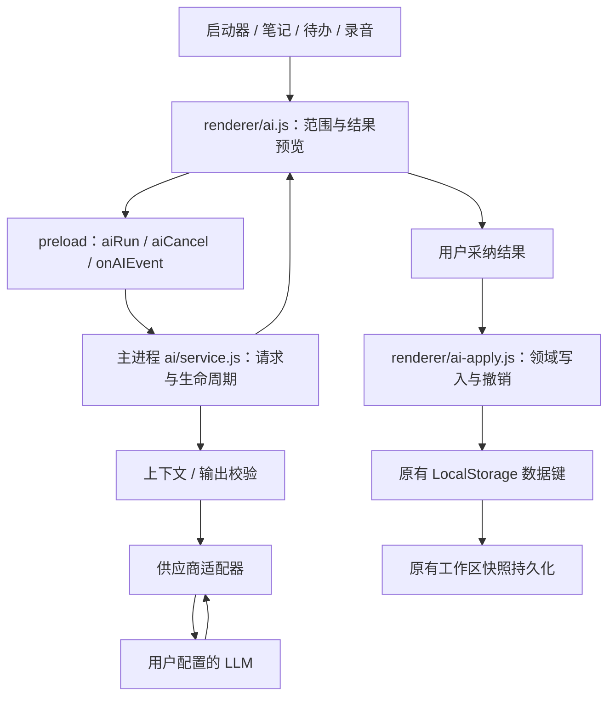

# AI 工作流技术设计

> 状态：设计基线，起点为 `f6e56d5`。核心 `ai/` 模块和 IPC 已实现；本文件保留完整目标设计，实际模块取舍和未完成项以 [07-implementation-report.md](07-implementation-report.md) 为准。

## 1. 分层与边界

保持 Electron 44 + 原生 JS，无渲染构建步骤、无后端、无新增框架。



- 主进程持有服务配置、凭据、HTTP 请求与取消控制器。
- renderer 从明确的 UI 对象生成上下文快照，不能将整个 `collectLocalStorageSnapshot()` 作为模型输入。
- 模型只返回文本或限定 schema，不能指定存储键、IPC 名、命令、磁盘路径或扩展动作。
- 领域写入仍由 renderer 完成，因为当前待办/笔记权威编辑状态在 renderer。主进程不根据周期同步、可能滞后的 workspace.json 直接改这些对象。
- 保持 `contextIsolation: true`、`nodeIntegration: false`、`sandbox: true`；preload 不暴露原始 ipcRenderer 或 fetch。

## 2. 拟新增模块及现有接入点

| 文件/区域 | 职责 |
| --- | --- |
| `ai/service.js` | 统一 run/cancel、请求代次、并发、超时、配置版本与工作区失效 |
| `ai/providers.js` | OpenAI-compatible 请求格式、SSE/普通 JSON、供应商专有参数 |
| `ai/policy.js` | 上下文白名单、端点验证、输入输出大小、数据最小化 |
| `ai/schema.js` | 主进程入参、响应、引用结构校验 |
| `ai/prompts.js` | 版本化动作提示和结构化示例，无远程可执行模板 |
| `renderer/ai-domain.js` | 可 Node 单测的纯规则：候选、日期、重复项、补丁与撤销前提；可按既有 domain 模式同时暴露浏览器全局 |
| `renderer/ai.js`、`renderer/ai.css` | 整理视图、稳定结果节点、状态和键盘 |
| `renderer/ai-apply.js` | 与现有待办/笔记保存 API 集成，单键写入及会话内撤销 |
| `main.js` | 组装服务和 IPC，复用安全存储；将现有两个 LLM 调用逐步交给网关 |
| `preload.js` | 受限的 start/cancel/event/settings/test 暴露 |
| `renderer/launcher.js`、`launcher/domain.js`、`launcher/service.js` | 注册固定内置命令及导航，拒绝扩展伪造具有上下文权限的内置 AI 命令 |
| `renderer/app.js`、`renderer/workspace.js` | 受控的笔记、待办与录音上下文获取，写入结果，保护未保存编辑内容 |
| `renderer/settings.js`、`renderer/index.html` | 在现有 AI 与转写分类管理开关与连接检测 |
| `package.json` | 在 `build.files` 加 `ai/**/*.js`，确保打包时包含新模块；本任务只计划，不执行打包 |

不在本阶段整体重写 `main.js` / `app.js`。先提供小接口与纯函数，再迁移调用，控制共享文件改动。

## 3. 内置动作与输出契约

动作 allowlist：

| action | 输入 | 输出 | 允许采纳方式 |
| --- | --- | --- | --- |
| `summarize` | 指定文本 | text + evidence | 复制、另存笔记 |
| `shorten` | 指定文本/选区 | text | 复制、另存；合法选区可替换 |
| `translate` | 指定文本 + 目标语言（中/英首发） | text | 同上 |
| `extractTodos` | 指定文本 + 分类名 + 时间基准 | todos + evidence | 编辑后加入原待办 |
| `organizeRecording` | 已保存转写 + 录音参考时间 | summary + decisions + todos + evidence | 分别另存笔记、加入待办 |
| `nameNote` / `nameRecording` / `nameLink` | 现有命名所需的最小文本 | title，适用时 category | 预览采纳；仅自动命名已开启时自动应用未修改对象 |

结构化响应无论供应商是否支持 JSON schema，都经过本地校验。日期、类别、长度、证据等都不能仅靠提示词保证。

### 3.1 请求与 IPC

拟新增：

- `ai:run` → `{ ok, requestId, error? }`，先确认接收，再用事件返回状态/结果。
- `ai:cancel` → `{ requestId }`；只允许原 sender 取消自己的请求，幂等。
- `ai:event` → `{ requestId, generation, type, ... }`，type 为 `started | textDelta | completed | failed | cancelled`。
- `ai:get-settings` / `ai:set-settings`：公开配置状态与偏好，Key 只写不回显。
- `ai:test-provider`：按钮显式发起固定的小测试，成功能力缓存绑定配置版本。

renderer 在 run 前先订阅事件；设置好 client request ID 与 generation 后再发送，避免第一条事件早于 Promise 返回。主进程校验 request ID 格式并绑定 sender/frame，拒绝正在使用的重复 ID；未来若换主进程分配 ID，需要在 ack 前缓冲事件。

示例仅表示拟定 JSON 结构，ID 与正文均为虚构：

```json
{
  "requestId": "ai-ui-17",
  "generation": 3,
  "action": "extractTodos",
  "context": {
    "sourceType": "note",
    "sourceId": "note-example",
    "sourceRevision": "sha256-of-snapshot",
    "text": "明晚九点前发产品演示视频",
    "selection": { "start": 0, "end": 12 }
  },
  "referenceTime": "2026-09-11T09:00:00+08:00",
  "timeZone": "Asia/Shanghai",
  "categories": {
    "P0": "学习与课程",
    "P1": "内容与创作",
    "P2": "产品与开发",
    "P3": "生活与事务"
  }
}
```

选区的起止按 JS 字符串索引计算。请求内容限制为已允许的字段；工作区身份/配置版本由主进程附加，不信任 renderer 传入的文件路径或绝对 workspace 目录。

`context.text` 来源于 renderer 内当前编辑状态，主进程可验证其形状、大小和 hash，但不能据此证明被攻陷的 renderer 获得了用户授权；安全保证依赖现有 renderer 隔离、严格 UI 来源适配器及不提供模型工具执行能力，不夸大为对被攻陷 renderer 的完全隔离。

### 3.2 待办候选示例

供应商返回的候选先转换为如下内部结构；`proposalId` 和 `candidateId` 由应用生成：

```json
{
  "proposalId": "proposal-17",
  "action": "extractTodos",
  "sourceRevision": "sha256-of-snapshot",
  "todos": [
    {
      "candidateId": "candidate-1",
      "text": "发产品演示视频",
      "categoryId": "P2",
      "deadlineText": "明晚九点前",
      "deadlineLocal": "2026-09-12T21:00",
      "dateStatus": "suggested",
      "evidence": { "sourceId": "note-example", "quote": "明晚九点前发产品演示视频" }
    }
  ]
}
```

- `categoryId` 仅 P0–P3 或 null；`dateStatus` 由本地校验生成，不采信模型自报“已确认”。
- 模型输出的时间仍是建议，必须经本地时区转换和用户预览；模糊、过去或冲突日期置为待选择。
- `evidence.sourceId` 必须来自输入 allowlist，quote 必须是对应文本的实际子串；本地计算 offset，多次出现时保留全部候选位置或使用供应商返回并经验证的 offset。
- 引用匹配只能证明文本确实存在，不能证明模型正确理解了承诺、否定和日期关系，仍需质量评测与用户审阅。
- 文本超出标题上限不能静默截断并保存；标记需精简。最多 20 条，异常超出数量/大小则整体响应失败，不丢尾部冒充完整结果。
- 不接受模型生成的永久对象 ID、存储键、已完成状态、remindedAt 或删除操作。

### 3.3 文字和录音结果

摘要有 `summary`，明确决定为 `decisions[]`，任务为 `todos[]`；摘要段落/决定可关联引用。无依据的决定移除并标示无法验证，或整体失败等待重试，不能直接保存为确定事实。

精简/翻译响应只作为文本渲染，不解析成操作。所有模型文本走安全文本或现有受限 Markdown 预览；不允许 HTML、脚本、远程图片或不安全链接。

## 4. 上下文范围和日期

### 范围

- 首版 `manual | note | recording` 三类，不支持 `vault | allClipboard | extensionStorage | screen`。
- 整篇笔记输入移除图片引用目标、data URL 和不可见附件信息；展示实际被发送的文本。生成的新笔记是纯文本 Markdown，不复制源附件路径。
- 选区替换的校验基于未剥离的原始正文。若选区跨图片 Markdown 或无法稳定映射，禁用替换，仅复制/另存。
- 正在编辑的笔记先将 pending editor 内容纳入快照并完成本地保存；若保存失败停止动作，避免模型看到旧正文。
- 录音使用已保存 transcript，绝不在 LLM 请求中附带 audioPath、音频或未经选择的其他录音。
- 主进程实施输入总量限制；超长源不自动截断，UI 要求选范围。保留完整转写在原存储，不以新上限裁剪用户材料。

### 日期

主进程为请求固定时间基准，校验 renderer 选择的参考时间与时区格式。历史录音参考其 createdAt；无法恢复原时区时在 UI 说明。模型提议本地年月日时分，本地规则校验日期真实存在（含闰年）、时区/DST、是否过去及是否仅为计划开始时间。

使用日历加减天数处理明天、下周等，不用固定 `24*3600*1000` 处理跨 DST 日期。中文口语含糊时不引入不可解释的猜测阈值；标记待确认。

`calendarDeadline` 当前仅验证部分日期字段，实施时扩展纯日期验证或新增 helper，覆盖 DST 缺失小时及重复小时；保持旧日历选择行为兼容。用户主动选择今天/本周/以后默认日期时复用既有 `defaultTodoDeadlineForScope`。

## 5. 请求生命周期、资源和成本

- 每个 renderer 同时一个交互请求；最多一个低优先级自动命名请求。全应用最大 2 个 LLM 在途请求，自动队列最多 10 项，按源 ID + revision 合并。
- 新交互请求取消旧交互请求；用户请求优先于尚未发送的自动命名任务。ASR 实时连接独立管理，不计入 LLM 并发。
- 请求绑定 sender、frame、workspace generation、config revision；任何一项变化立即 abort，并拒收旧响应。
- 关闭视图的 UI 立即转已停止；abort 只表示本机停止等待/接收，不能承诺供应商未计费或已停止服务端计算。
- 默认 30s，总时限 10–60s；自动命名使用较短 10s。断流、缺失结束标记和超大输出失败，不把不完整任务当结果应用。
- 默认 `max_tokens` 2048（短文本）/4096（提取与录音整理），具体参数按供应商能力发送。输入字符上限不等于 token 上限，服务返回上下文过长时提示缩小范围。
- JSON 结果收齐后校验；文字响应支持时可流式显示。流式不兼容则使用非流式模式，不自动再发一次相同付费请求。
- 不自动重试可能已受理的请求，不自动跨服务商回退。明确 401/403、429、模型不存在、格式不支持、网络超时等原因，用户手动重试。
- 供应商 usage 有则显示实际 token；没有则标“未提供”，不当作 0。未配置价格时不显示虚构金额。
- 诊断保存动作、服务标识、模型、耗时、状态、错误码、usage、promptVersion；默认只保留最近 50 条本机记录，不记录正文、标题、引用、完整 URL 或 Key。

## 6. 端点和供应商兼容

### 首版远程服务

- 复用当前 OpenAI-compatible 配置，保持旧 Key/Base URL/模型，不在升级中自动换模型。
- 远程端点要求 HTTPS 公网地址；拒绝 userinfo、fragment、本机/内网/链路本地地址与不安全端口策略。端点在使用时重新校验 DNS/IP；传输不得跟随重定向转发 Authorization。
- DNS 校验必须与实际连接地址绑定；仅“先 resolve 检查，再普通 fetch 重新解析”不足以应对 DNS rebinding。阶段 M0 的适配器需评估自定义 lookup/连接实现，按主机保留 TLS 校验并测试 IPv4/IPv6。
- 现有 `validatePublicHttpUrl` 可复用地址分类规则，但不能因此宣称已有完整端点安全实现。链接抓取的公网规则不放宽。
- Base URL 统一归一化，避免 `/v1/v1` 和重复 `/chat/completions`。供应商专有 `thinking` 等参数在 adapter 中处理，不以字符串 `includes('deepseek.com')` 当域名身份判断。
- 能力缓存至少包含 stream、jsonObject、usage，绑定 provider/model/config revision。连接测试用固定小示例，验证可解析且满足 schema，不仅看 HTTP 200。
- 可配置 OpenAI-compatible 不等于兼容所有原生 Anthropic/Google API；原生协议适配后置。

### 后续本机服务（NEXT-003）

- 独立 `kind: local`，只允许显式配置的 `127.0.0.1`、`[::1]` 或经验证为 loopback 的 localhost 与端口；不默认放行 RFC1918 局域网。
- 只对该本机 profile 允许 HTTP/无 Key，拒绝重定向；不携带远程 profile 的 Authorization，不受系统代理转发到远端。
- 服务类型/模型是否实际本地运行需验证；不能仅因 API 地址是 localhost 就保证服务背后不会转发云端。
- 云 ASR 与本机 LLM 独立。使用本机 LLM 不等于录音转写完全离线。
- 本机模型不启动时提示打开服务，应用不自动安装、下载模型或执行 Shell。

## 7. 本地写入、去重与撤销

### 7.1 首版数据结构

正式待办继续保存为：

```json
{
  "P0": [],
  "P1": [],
  "P2": [
    {
      "id": "app-generated-id",
      "text": "发产品演示视频",
      "done": false,
      "createdAt": 1789117200000,
      "deadline": "2026-09-12T13:00:00.000Z",
      "remindedAt": 0
    }
  ],
  "P3": []
}
```

示例时间仅用于说明序列化，不构成默认日期。

正式笔记维持 `{ id, title, titleSource, content, createdAt, updatedAt }`；AI 生成并由用户采纳的标题使用现有 titleSource 语义，不新增丢失于 normalize 的字段。录音不新增 summary 字段，摘要保存为新笔记。

首版不新增 AI 草稿 LocalStorage 键、不持久化长对话或所有输入副本。预览、proposalId、quote、应用映射与撤销记录存在会话内存中，工作区切换时丢弃。永久双向来源关系如后续需要，再做独立数据方案。

### 7.2 应用结果

1. 读取当前源 revision、分类名和目标键；检查工作区是否仍匹配。
2. 校验选中候选，保留用户修改后的版本。未解决字段返回到 UI，不发起局部添加。
3. 在内存克隆当前目标根，调用领域函数生成全部对象，预先分配应用生成的 ID。
4. 同步临界区完成最后版本检查和 `localStorage.setItem`；两者之间不 `await`。一次批量待办只写一次 `notch-todo-data`，不要循环调用当前 `addTodo` 产生逐项保存。
5. setItem 成功后更新内存权威对象、渲染列表、数量和提醒；异常时保持旧内存/界面，避免幽灵条目。
6. 记录 proposal 对该目标的成功状态及 ID，同一 proposal 再点只返回已有成功结果。
7. 立即请求现有 workspace snapshot 保存并检查布尔结果。LocalStorage 成功但工作区保存失败时，显示“已保存在本机，工作区同步失败”；重试只同步，不能再次追加对象。

只为新 AI 批量路径抽出返回明确状态的领域 API，不把所有原有编辑逻辑在同一阶段重写。

同时另存笔记和加入待办时，两个独立按钮各写一个键，各自反馈和撤销。这里不存在跨键原子性承诺；第一项成功、第二项失败时保留第一项。

### 7.3 去重与撤销

- 重复点击：用会话内 proposal ID + target action 防止重复应用；重新生成有新 proposal，须重新做内容重复提示。
- 重开应用后没有旧草稿可自动重放，因此不需要跨重启幂等队列。用户再次粘贴同样内容由语义简化/文本标准化后的重复提示辅助，不自动合并。
- 新增待办撤销：只删除本次新增且字段仍匹配写入快照的项；已编辑、完成或移动领域的项视为冲突，提示保留。
- 替换选区撤销：源对象和应用后正文必须匹配；不匹配则返回 conflict，提供原文复制，不覆写用户新编辑。
- 新建笔记撤销：仅移除本次生成且未被编辑的笔记，随后刷新原有 UI/搜索缓存。MVP 新生成笔记没有新增图片附件。
- 撤销结果及限制作文字反馈；撤销记录只在会话内有效，UI 不许诺跨退出恢复。

## 8. 现有调用的兼容迁移

继续使用 `transcription-settings.json` 保存 ASR/LLM 凭据，新增有版本的内容整理开关与超时字段；同一配置文件原子写入，保留未知/旧字段以避免一处保存覆盖另一处配置。

1. 先建立统一 gateway，由现有 `smart:organize-material` 和 `enrichLinkMetadata` 转调；保留旧 preload 形状直到所有调用者迁移完。
2. 缺少自动动作字段的旧配置保留 Key，初始化 LLM 自动开关为 false；首次说明“自动命名改为按需开启”，现有标题不重写。
3. 已配置 ASR 用户保留主动录音时转写，新增开关与内容整理开关分别保存。
4. 自动命名回写增加 expected revision/手工修改保护；现有录音回写没有充分版本检查，优先补齐。
5. 原先 8000 字符的静默裁剪移除；超长命名场景跳过并提供手动选范围，链接元数据仍按自身小文本上限处理。
6. 持久化失败显示错误而非保存成功；配置变更取消使用旧 profile 的请求。
7. 清除环境/系统密钥不可解密状态后才能重试；任何时候不回显明文。

## 9. 后续工作区问答和长内容

NEXT-002 新建受控检索适配器，默认来源为用户启用且选择的笔记、待办、链接元数据、录音转写。与 launcher 的显示结果分离：launcher 没有录音索引，长笔记关键词也被裁剪，不能直接作为完整检索实现。

候选方案：本地关键词检索 → 最多 8 个片段、4 个对象 → 预览来源勾选 → 仅发送选中内容 → 返回带引用回答。分段约 800–1200 字符并保留位置；总上下文不超过设定预算。召回不足时明确提示范围有限，无匹配不请求模型。

主进程校验引用 ID 属于本次来源；renderer 打开来源时重新检查存在性和 revision。没有匹配引文的结论不能当作有证据回答。引用指向应用内对象和文字，不让模型提供任意导航 URL。

NEXT-001 长文处理每段都有稳定 ID、覆盖范围与结果状态，再合并摘要/去重任务；展示实际覆盖比例，某段失败不得显示“全文整理完成”。分段会增加调用次数，开始前显示预计分段数，支持总预算上限和停止。首版的超限拒绝在此任务完成后才替换。

## 10. 验证和交付

纯逻辑用 Node 测试，provider 用本地假 HTTP/SSE 服务验证错误/取消/上限，真实 Electron 用固定假响应验证 UI 与存储。真实模型质量单独跑脱敏语料，不作为默认 `npm test` 的付费依赖。

实施时同步 `package.json` 打包文件列表、README 行为和 CHANGELOG，补齐两平台源码验证。打包/发布需要届时明确授权；本技术设计不包含执行授权。详细任务与标准见 [开发计划](05-development-plan.md) 和 [验收计划](06-validation-plan.md)。
