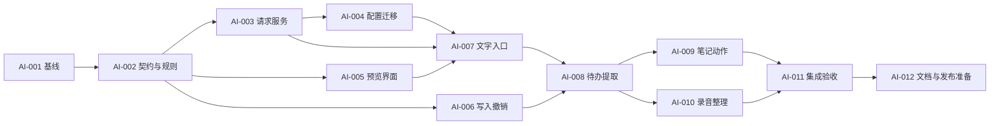

# AI 工作流开发计划

> 状态：核心 MVP 已按本计划实施；原始任务定义和估算保留用于追溯。实际完成证据、偏差及仍未执行的质量/平台验收见 [07-implementation-report.md](07-implementation-report.md)。

## 1. 交付阶段与估算

估算单位为熟悉本项目的开发者人日，包含任务自身单测，不包含等待用户试用、第三方服务排障和商店/签名申请。非承诺交付日期。

| 阶段 | 任务 | 可评审交付 | 人日 |
| --- | --- | --- | ---: |
| M0 基础与兼容 | AI-001–AI-004 | 测试基线、统一调用、schema、配置和自动命名迁移 | 5–8 |
| M1 第一条使用路径 | AI-005–AI-008 | 启动器文字动作 → 草稿预览 → 加入待办 → 撤销 | 7–11 |
| M2 录音/笔记完整闭环 | AI-009–AI-012 | 就地动作、录音整理、功能/质量验收和发布准备 | 5.5–9 |
| MVP 合计 | AI-001–AI-012 | FR-001–FR-016 全部完成 | **17.5–28（排期约 18–28）** |

另留约 20% 风险余量，主要来自现有保存 API 的失败语义、日期/DST、供应商协议与 Electron 焦点回归。M0 结束后重估；若超预算先缩减文字动作数量，不能削掉保存校验、来源确认与取消逻辑。

M1 是第一轮可试用版本；M2 完成才称为本方案 MVP。第二阶段问答、本机模型与长内容不计入该估算。

## 2. 依赖和并行边界



- 契约确定后，预览组件可用假 provider，与请求服务和纯写入规则并行开发。
- `main.js` / `preload.js` 的 IPC 由一人集成；`renderer/app.js` 的领域写入由一人负责，避免并行修改覆盖状态。
- 笔记和录音动作可在共用预览/应用 API 稳定后并行，分别维护 app.js 和 workspace.js 的小范围接入。
- 多人实施时按文件所有权拆任务；共享文件串行集成、每个任务独立提交。当前不启动代理、不创建 worktree。

## 3. M0：基础与兼容

### AI-001：建立真实基线与评测样本清单

- 目标：确认当前保存、命名、转写与窗口行为，冻结首版质量样本。
- 输入：本目录全部文档、根 README、现有测试。
- 文件/区域：`tests/`、`docs/project-factory/ai-workflows/06-validation-plan.md`，拟新增脱敏 `tests/fixtures/ai/`。
- 步骤：运行现有 `npm test`；记录平台/跳过项；检查旧录音改名竞争、LocalStorage quota、工作区 8 MiB 限制；整理约 60 条固定时间/时区的人工样本。
- 验收：基线失败与新失败可区分；样本覆盖否定、相对日期、重复、中文混合术语及无行动项；不使用用户私密数据。
- 建议负责人：开发 + QA。
- 依赖：无。
- 估算：0.5–1 人日。

### AI-002：定义 schema、上下文与领域纯函数

- 目标：让生成结果可以可靠校验，且能转成现有数据对象。
- 输入：FR-002、FR-004–FR-008、FR-011、FR-015，技术设计第 3/4/7 节。
- 文件/区域：新增 `ai/schema.js`、`ai/policy.js` 的纯规则、`renderer/ai-domain.js`、对应 Node 测试。
- 步骤：实现 action/source allowlist、长度/数量限制、真实引用匹配、类别映射、日期候选校验、重复项提示、源版本和候选编辑模型。
- 验收：非法输出不能写入；P0–P3 不变；无日期候选保留；支持固定时钟、闰年、跨日、DST 和 80 字符标题边界。
- 建议负责人：领域开发。
- 依赖：AI-001。
- 估算：1–2 人日。

### AI-003：统一模型请求与生命周期

- 目标：提供可取消、可限流、可观测的主进程服务。
- 输入：AI-002 契约，现有 `resolveLlmConfig`、材料/链接请求代码。
- 文件/区域：新增 `ai/service.js`、`ai/providers.js`、`ai/prompts.js`；`main.js`、`preload.js`；provider/IPC 测试。
- 步骤：接入固定内置动作；实现 sender/workspace/config 绑定，abort/超时/输出上限；provider 参数隔离；HTTPS 公网端点与连接 DNS 绑定；测试 JSON 和 SSE；将旧命名请求转调统一服务。
- 验收：关闭后无旧响应覆盖；错误、截断、401/429、不兼容格式均可解释；凭据不跟随重定向；普通搜索无调用；无自动跨服务商回退。
- 建议负责人：Electron 主进程开发。
- 依赖：AI-002。
- 估算：2–3 人日。

### AI-004：配置、连接检测与自动命名迁移

- 目标：让内容整理可配置且自动行为可理解。
- 输入：FR-012/013/016、需求迁移规则，AI-003 服务。
- 文件/区域：`main.js` 配置读写、`renderer/settings.js`、`renderer/workspace.js`、`renderer/index.html`、`renderer/settings.css`；配置测试。
- 步骤：保留旧 Key/模型/ASR；新增内容自动开关、超时、连接/JSON 能力测试、元数据诊断；首次升级说明；笔记/录音/链接自动命名校验用户修改与源版本；取消超长文本静默裁剪。
- 验收：自动命名默认关闭，用户可主动恢复；原 ASR 使用体验保留；保存设置不触发网络测试；连接测试失败不丢 Key；录音回写不覆盖用户改名。
- 建议负责人：设置 UI + 主进程开发。
- 依赖：AI-003；表单可先并行。
- 估算：1.5–2 人日。

M0 完成条件：请求服务和旧功能迁移均通过，不增加用户未触发的模型请求。此时重新评估协议兼容与安全实现投入。

## 4. M1：文字到待办

### AI-005：共用整理与结果预览

- 目标：完成输入、生成、结果编辑、停止与恢复来源的交互容器。
- 输入：交互设计全文，AI-002 契约，假响应。
- 文件/区域：新增 `renderer/ai.js`、`renderer/ai.css`；`renderer/index.html`；必要的 `renderer/app.js` 模式导航适配。
- 步骤：来源范围展示、原文/结果布局、候选行稳定复用、状态语义、键盘/IME、窄屏；返回恢复焦点与滚动；会话内草稿保留和工作区切换失效。
- 验收：640×400 和标准内容区底部操作可达；Escape/Tab 正确；生成完不抢焦点；不增新 BrowserWindow；无结果闪烁/整表刷新。
- 建议负责人：界面开发。
- 依赖：AI-002，可与 AI-003 并行。
- 估算：2–3 人日。

### AI-006：原子批量写入、幂等与撤销

- 目标：安全地将用户采纳的结果写入既有待办/笔记。
- 输入：AI-002、技术设计第 7 节。
- 文件/区域：新增 `renderer/ai-apply.js`；`renderer/app.js` 保存接口；`renderer/domain.js` 必要 helper；Node 与 Electron 存储测试。
- 步骤：克隆根数据、检查源版本、一次 setItem、成功后更新内存/UI/提醒；单 proposal 应用锁；当前字段比对撤销；主动持久化与失败分层反馈。
- 验收：重复点击只保存一次；quota 时没有半批任务/幽灵数据；新笔记达到现有容量时提示而不是自动挤掉旧笔记；同步失败重试不重复追加；撤销不删用户已编辑内容。
- 建议负责人：领域与持久化开发。
- 依赖：AI-002；与 AI-005 分文件并行。
- 估算：2–3 人日。

### AI-007：启动器文字动作

- 目标：让用户找到并执行摘要、精简、翻译。
- 输入：AI-003/004/005，FR-001。
- 文件/区域：`renderer/launcher.js`、`launcher/domain.js`、`launcher/service.js`、`renderer/ai.js`；命令导航与键盘测试。
- 步骤：注册固定内置命令；选择后导航至整理视图；保持查询本地；显式生成；文本复制/另存复用 AI-006 API（可先接复制）。
- 验收：普通/正则搜索不会发模型请求；无 Key 有配置入口且返回不丢输入；AI 视图快捷键不触发应用管理员/新窗口动作。
- 建议负责人：启动器/UI 开发。
- 依赖：AI-003、AI-004、AI-005；另存功能依赖 AI-006。
- 估算：1–2 人日。

### AI-008：从文字提取待办完整流程

- 目标：交付第一条可实际使用的路径。
- 输入：AI-006/007、日期和引用契约、固定评测样本。
- 文件/区域：`renderer/ai.js`、`renderer/ai-domain.js`、`ai/prompts.js`、待办页入口、测试。
- 步骤：提取候选、原文依据、分类映射、日期待补充、重复提示、勾选与批量应用；保留“今天/本周/以后”现有默认日期动作。
- 验收：候选无原文不默认采纳；模糊日期阻止对应保存；提取不创造计划；写入后正常提醒、搜索和时间视图；完成至少一轮人工输出质量评测。
- 建议负责人：功能开发 + QA。
- 依赖：AI-006、AI-007。
- 估算：2–3 人日。

M1 完成条件：无 Key/网络失败可恢复；输入 → 生成 → 编辑 → 加入 → 撤销的 Electron 流程通过。可以进行小范围源码试用，尚不称为整个 MVP 完成。

## 5. M2：笔记、录音与完整验收

### AI-009：笔记就地动作与标题采纳

- 目标：让用户在笔记页直接整理选区或正文。
- 输入：FR-009/011/012、共用预览与写入 API。
- 文件/区域：`renderer/app.js`、`renderer/ai.js`、笔记工具栏样式、`ai/prompts.js`；笔记交互测试。
- 步骤：获取最新编辑内容/选区；摘要、精简、翻译和提取待办；复制/另存；合法选区替换与版本检查；手动生成标题；图片引用范围保护。
- 验收：未保存编辑不丢；源改变时禁止覆盖；图片与相对路径保持；AI 新笔记不带无效源附件；手工标题不被后台覆盖。
- 建议负责人：笔记功能开发。
- 依赖：AI-008。
- 估算：1–2 人日。

### AI-010：录音结束后的整理

- 目标：打通转写到摘要、笔记和行动项。
- 输入：FR-010、AI-008 的预览/应用能力，现有录音生命周期。
- 文件/区域：`renderer/workspace.js`、`renderer/ai.js`、`ai/prompts.js`；录音/转写回归测试。
- 步骤：音频保存后开放整理；按录音开始时间解释相对日期；处理空/超长/部分转写；显示摘要、明确决定、行动项；分别另存笔记和加入待办。
- 验收：ASR/LLM 任一失败不影响音频保存和 track 释放；没有转写不假称可重新识别音频；摘要不覆盖转写；不显示不存在的时间戳/说话人；两个保存动作独立反馈。
- 建议负责人：录音功能开发。
- 依赖：AI-008，可与 AI-009 并行。
- 估算：2–3 人日。

### AI-011：集成、模型质量与双平台回归

- 目标：达到验收计划中的技术和内容质量门槛。
- 输入：FR/NFR 全集、M0 样本、M2 实现。
- 文件/区域：`tests/`、`scripts/test-desktop.js`（如需）、`06-validation-plan.md` 的执行记录。
- 步骤：无外网 Node/假 provider/Electron 自动化；Windows/macOS 源码人工验证；有可用 Key 和调用范围时进行脱敏真实模型评测；修复质量或流程失败。
- 验收：默认测试不付费；取消/过期/保存失败/DST/输入法/多屏边界通过；模型指标单独记录，不把假响应测试当作模型准确率。
- 建议负责人：QA + 主进程/UI 开发。
- 依赖：AI-009、AI-010。
- 估算：2–3 人日；真实服务与平台等待时间另计。

### AI-012：文档、打包清单与发布准备

- 目标：完成可审查的交付记录。
- 输入：AI-011 结果，根 README、AGENTS、发布规范。
- 文件/区域：README、CHANGELOG、`package.json` 的 `build.files`、本目录验收执行记录；需要发版本时 package-lock 与下载入口联动。
- 步骤：记录实际实现与限制；加入 `ai/**/*.js` 打包清单；检查两平台安装包内所需 renderer/worker/新模块；形成版本与发布检查项。
- 验收：文档不声称 NEXT 已实现；未获得打包授权时仅准备清单，安装包验收标“未执行”；推送/发布时遵守两平台资产与 Pages 规范。
- 建议负责人：集成负责人。
- 依赖：AI-011。
- 估算：0.5–1 人日。

## 6. 后续工作包

以下估算为初步范围，不承诺日期，不在 MVP 中顺带实施。

| 任务 | 目标和主要文件 | 依赖/步骤 | 验收 | 建议负责人 / 估算 |
| --- | --- | --- | --- | --- |
| AI-101 长内容整理 | 新增 `ai/chunking.js`、service/UI 分段状态 | AI-011；覆盖分段、合并、去重、总预算、失败重试 | 任一段失败不冒称全文完成；引用仍映射原文 | 主进程/领域，3–5 日 |
| AI-102 工作区问答 | 新增受控检索模块、来源预览、引用导航 | AI-011；关键词召回、片段选择、回答、失效检查 | 无检索结果不猜答案；不读取密钥/隐藏来源；旧引用不误跳 | 检索/UI，5–8 日 |
| AI-103 本机 Ollama | provider/policy/settings | AI-011；独立 loopback profile、无 Key、非代理直连、模型能力检查 | 不放宽链接 SSRF；不传远程 Key；未启动时可恢复 | 主进程，2–4 日 |
| AI-104 自定义文字命令 | 模板 schema、本机设置、launcher 入口 | 内置使用反馈稳定；导入仅模板，不执行代码 | 普通旧指令仍复制；模板不能访问任意数据/工具 | 功能开发，3–5 日 |
| AI-105 任务建议 | prompts/UI；生成建议而非原文提取 | 日期/批量应用稳定；区分建议语义 | 明示新建议；只生成独立待办草稿 | 产品/功能，2–3 日 |
| AI-106 完成事件转笔记 | 通知历史详情、note apply | 有真实需求；仅选择本地已收到事件字段 | 不读取 Agent 会话、不编造任务总结、无自动 LLM | 功能开发，1–2 日 |
| AI-107 系统上下文研究 | 单独双平台技术 spike 文档 | 焦点、辅助功能、剪贴板恢复、权限差异试验 | 明确哪些应用可读取/回填；失败不覆盖别的窗口 | 原生开发，先研究 2–3 日，再估实施 |
| AI-108 网页正文摘要 | 主进程受控正文提取、link UI | 链接安全和内容长度策略验证；提取→预览→摘要 | 保留公网/重定向边界；登录页及提取失败有说明 | 网络/功能，3–5 日 |

## 7. 风险与缩减策略

| 风险 | 影响 | 应对 |
| --- | --- | --- |
| 中文日期/否定句理解不稳定 | 错建待办 | 引用、待补字段、固定语料；降级保留原文让用户手填，不直接自动写入 |
| 现有 saveData 无明确失败回执 | 内存与持久化不一致 | AI-006 先做单键领域接口与故障注入，不用循环模拟点击 |
| 笔记保存存在条数上限 | 另存可能挤掉旧笔记 | 在 AI 写入前做容量检查，提示整理容量；不能静默删除旧记录 |
| 模型协议不同 | 部分动作不可用 | 小能力测试 + adapter；禁用该模型不支持的动作，保留已有配置 |
| 新模块未进打包白名单 | 开发可用而安装后失败 | AI-012 必查 build.files；安装包验证单独留证 |
| 单平台自动测试掩盖焦点问题 | Windows/macOS 体验不一致 | 双平台源码与实机输入验证；不伪造性能采样成功 |
| 方案过大 | 首条路径迟迟不可用 | M1 先试用；必要时首轮仅提取待办与摘要，但整套 MVP 完成范围须重新标注 |

## 8. 每阶段记录模板

```text
阶段 / 提交：
完成的任务 ID：
通过的 FR/NFR/验收项：
实际测试命令及结果：
真实服务 / 模型 / promptVersion（不含 Key）：
平台与可用尺寸：
未通过、跳过与未执行项：
是否改变需求及原因：
后续依赖：
```

只有实施后填写以上结果，不能直接复用计划中的目标值作为测试结果。
